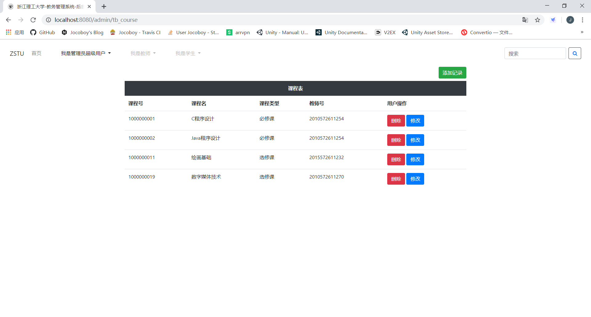

# 教务管理系统-MySQL数据库设计

Express+EJS+Bootstrap+MySQL

## 需求分析

1. 分为学生用户、教师用户、管理员超级用户三种用户类型
2. 通过用户类型选择，输入账号、密码登录系统
3. 进入个人中心可修改个人信息(如密码等)
4. 访问权限：

|  用户类型   | 课程表(course)   | 学生信息表(student)  | 教师信息表(teacher) | 选修关系表(sc) | 教学任务表(tc) |用户表(user) |
|  :----:  | :----:  | :----:  | :----:  | :----:  |:----:  |:----:  |
| 学生用户  | yes | yes | no | yes |no |no |
| 教师用户  | yes | no | yes | yes |yes |no |
| 管理员超级用户  | yes | yes | yes | yes | yes | yes |

5. 操作权限：

|  用户类型   | 权限内容 |
|  :----:  | :----:  |
| 学生用户  | 查询课程库信息、个人成绩、教学任务，添加选课记录 |
| 教师用户  | 添加、修改、删除教学任务，添加学生成绩记录 |
| 管理员超级用户  | 查询和修改任意表 |

## 概念结构设计

教务管理涉及以下几个实体:
- 学生：属性有学号、姓名、性别、年龄
- 教师：属性有教师号、姓名、职称
- 课程：属性有课程号、课程名、课程类别

实体间的联系如下：

(1)一个学生可以选修多门课程，一门课程可被多名学生选修，所以学生和课程之间是多对多(m:n)关系。

(2)一个教师可以教授多门课程，一门课程可被多名教师教授，所以课程和教师之间是多对多(m:n)关系。

E-R图表示如下：

UML类图表示如下：

## 逻辑结构设计

### E-R图向关系模型的转换

将E-R图转换为关系模型，关系的码用**粗体**显示。

|  关系模式   | 归属类别 |
|  :----:  | :----:  |
| 学生(**学号**，性别，姓名，年龄)  | 实体 |
| 课程(**课程号**，课程名，课程类别)  | 实体 |
| 教师(**教师号**，性别，职称)  | 实体 |  
| 选修(**学号**，**课程号**，成绩)  | 联系 |  
| 教授(**课程号**，教学任务)  | 联系 |  

## 物理结构设计

### 选择合适的存储引擎

MySQL数据库提供了InnoDB、MyISAM、ndbcluster、MEMORY、FEDERATED、ARCHIVE、CSV、BLACKHOLE、MRG_MyISAM等9种存储引擎。

本数据库采用MySQL默认存储引擎InnoDB。该引擎支持事物和多版本并发控制(MVCC)的行级锁，且支持外键完整性约束。

## 数据库实施

### MySQL字段标识说明

|  标识符| sql 关键字   | 含义 |备注 |
|  :----: |  :----:  | :----:  |:----:  |
| PK |primary key | Belongs to primary key |主键|
| NN |not null | Not Null |非空|
| UQ  | unique| Unique index | 唯一索引| 
| B  |binary| Is binary column |存放二进制数据的列  | 
| UN |unsigned | Unsigned data type | 无符号数 （例如-500 to 500替换成0 - 1000,需要整数形数据） |
| ZF |/ | Fill up values for that column with 0's if it is numeric |  填充0位（例如指定3位小数，整数18就会变成18.000） |
| AI | auto_increment| Auto Incremental | 自增 |
| G  |generated| Generated Column | 基于其他列的公式生成值的列 |

## 数据库运行和维护

- 采用`crypto`模块的`MD5`信息摘要算法，将用户密码以暗文形式存储
- 采用参数化查询，防止SQL注入攻击

## 数据字典

### course (课程表) 
| 序号 | 字段名称 | 数据类型 | 是否为空 | 字段说明 |
| :--: |----| ---- | ---- | ---- |
| 1 | Cno | char(10) | NO | 课程号 |
| 2 | Cname | varchar(20) | YES | 课程名 |
| 3 | Ctype | varchar(5) | NO | 课程类别 |
| 4 | Tno | char(13) | NO | 教师号 |

### sc (选课关系表) 
| 序号 | 字段名称 | 数据类型 | 是否为空 | 字段说明 |
| :--: |----| ---- | ---- | ---- |
| 1 | Sno | char(13) | NO | 学号 |
| 2 | Cno | char(10) | NO | 课程号 |
| 3 | Grade | tinyint unsigned | YES | 成绩 |

### student (学生表) 
| 序号 | 字段名称 | 数据类型 | 是否为空 | 字段说明 |
| :--: |----| ---- | ---- | ---- |
| 1 | Sno | char(13) | NO | 学号 |
| 2 | Sname | varchar(10) | YES | 姓名 |
| 3 | Ssex | char(2) | NO | 性别 |
| 4 | Sage | tinyint unsigned | NO | 年龄 |

### tc (教学任务表) 
| 序号 | 字段名称 | 数据类型 | 是否为空 | 字段说明 |
| :--: |----| ---- | ---- | ---- |
| 1 | Cno | char(10) | NO | 课程号 |
| 2 | Tcontent | varchar(200) | YES | 教学任务 |

### teacher (教师表) 
| 序号 | 字段名称 | 数据类型 | 是否为空 | 字段说明 |
| :--: |----| ---- | ---- | ---- |
| 1 | Tno | char(13) | NO | 教师号 |
| 2 | Tname | varchar(10) | YES | 姓名 |
| 3 | Tposition | varchar(3) | NO | 职称 |

### user (用户表) 
| 序号 | 字段名称 | 数据类型 | 是否为空 | 字段说明 |
| :--: |----| ---- | ---- | ---- |
| 1 | Uaccount | varchar(16) | NO | 用户账号 |
| 2 | Upwd | char(32) | NO | 用户密码 |
| 3 | Utype | varchar(3) | YES | 用户类型 |
| 4 | Uno | char(13) | YES | 学生和教师独有属性列 |
