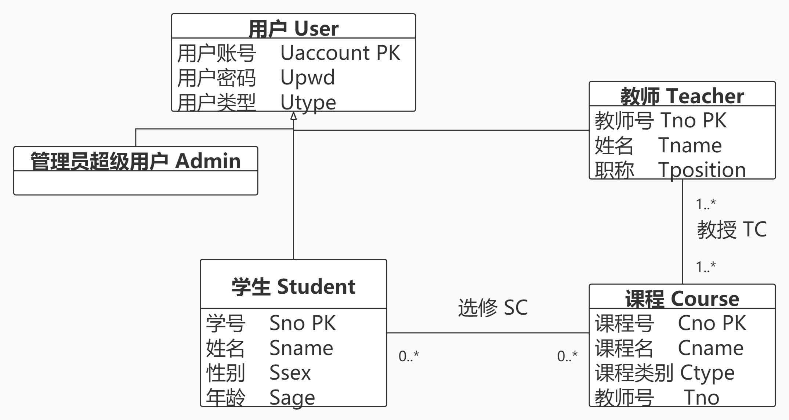

# 教务管理系统-MySQL数据库设计

## 需求分析

1. 分为学生用户、教师用户、管理员超级用户三种用户类型
2. 通过用户类型选择，输入账号、密码登录系统
3. 进入个人中心可修改个人信息(如密码等)
4. 表级权限：

|  用户类型   | 课程库表   | 成绩表  | 学生信息表 |教学任务表 | 用户表 |
|  :----:  | :----:  | :----:  | :----:  | :----:  |:----:  |
| 学生用户  | yes | yes | yes | no |no |
| 教师用户  | yes | yes | yes | yes |no |
| 管理员超级用户  | yes | yes | yes | yes | yes |

5. 用户级权限：

|  用户类型   | 权限内容 |
|  :----:  | :----:  |
| 学生用户  | 查询课程库信息、个人成绩、教学任务，添加选课记录 |
| 教师用户  | 添加、修改、删除教学任务，添加学生成绩记录 |
| 管理员超级用户  | 查询和修改任意表 |

## 概念结构设计

教务管理涉及以下几个实体:
- 学生：属性有学号、姓名、性别、年龄
- 教师：属性有教师号、姓名、职称
- 课程：属性有课程号、课程名、课程类别
- 院系：属性有系别号、系名

实体间的联系如下：

(1)一个学生可以选修多门课程，一门课程可被多名学生选修，所以学生和课程之间是多对多(m:n)关系。

(2)一个教师可以教授多门课程，一门课程可被多名教师教授，所以课程和教师之间是多对多(m:n)关系。

(3)一个院系可以拥有多名教师，一个教师只属于一个院系，所以院系和教师之间是一对多(1:n)的关系。

(4)一个院系可以拥有多名学生，一个学生只属于一个院系，所以院系和学生之间是一对多(1:n)的关系。

E-R图表示如下：

UML类图表示如下：

## 逻辑结构设计

### E-R图向关系模型的转换

将E-R图转换为关系模型，关系的码用**粗体**显示。

|  关系模式   | 归属类别 |
|  :----:  | :----:  |
| 学生(**学号**，性别，姓名，年龄)  | 实体 |
| 课程(**课程号**，课程名，课程类别)  | 实体 |
| 教师(**教师号**，性别，职称)  | 实体 |  
| 院系(**系别号**，系名)  | 实体 |  
| 选修(**学号**，**课程号**，成绩)  | 联系 |  
| 教授(**教师号**，**课程号**)  | 联系 |  
| 属于(**教师号**，**院系**)  | 联系 |  
| 拥有(**学生号**，**院系**)  | 联系 |  

## 物理结构设计

### 选择合适的存储引擎

MySQL数据库提供了InnoDB、MyISAM、ndbcluster、MEMORY、FEDERATED、ARCHIVE、CSV、BLACKHOLE、MRG_MyISAM等9种存储引擎。

本数据库采用MySQL默认存储引擎InnoDB。该引擎支持事物和多版本并发控制(MVCC)的行级锁，且支持外键完整性约束。

## 数据库实施

## 数据库运行和维护